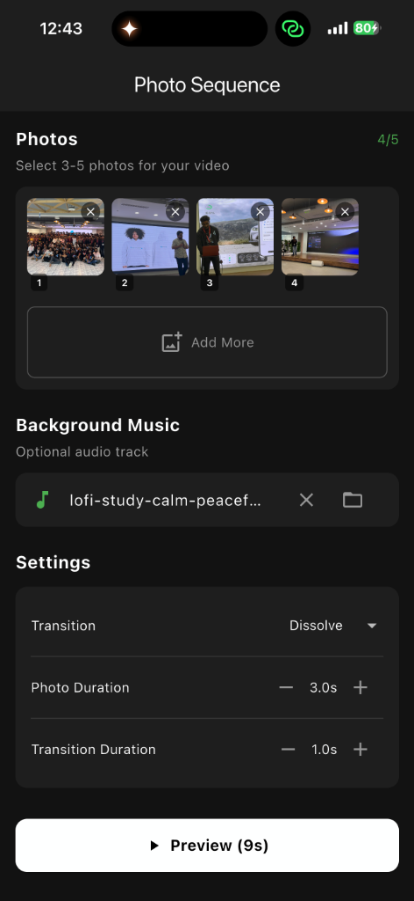
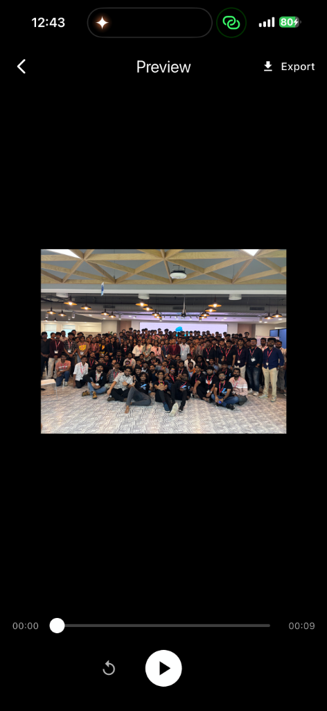
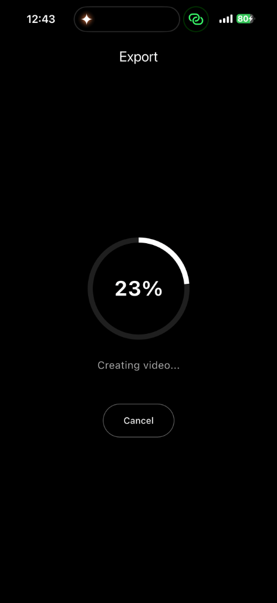
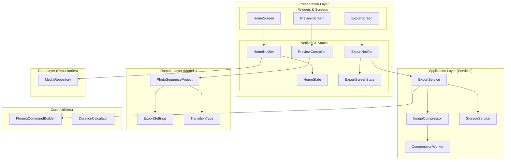

# Photo Sequence


A Flutter application that transforms 3-5 photos into a synchronized video with professional dissolve/slide transitions and background music, exported as a high-fidelity .mp4 file.

> **📱 Mobile Only** - This app supports **iOS** and **Android** only. Desktop and web platforms are not supported due to FFmpegKit limitations.

## Screenshots

| Home Screen | Preview Screen | Export Screen |
| :---: | :---: | :---: |
|  |  |  |

## Features

- 📷 **Photo Selection** - Select 3-5 photos from your gallery
- 🎵 **Background Music** - Add optional audio track
- 🔄 **Transition Effects** - Dissolve, Slide Left/Right/Up/Down
- ▶️ **Real-time Preview** - Preview animations before export
- 📹 **Video Export** - High-quality MP4 output (720p/1080p)
- 💾 **Gallery Save** - Automatic save to device gallery

## Supported Platforms

| Platform | Status |
| :--- | :--- |
| iOS | ✅ Supported |
| Android | ✅ Supported |
| macOS | ❌ Not Supported |
| Windows | ❌ Not Supported |
| Linux | ❌ Not Supported |
| Web | ❌ Not Supported |

## Architecture



### Architectural Principles

The project follows **Feature-First Clean Architecture** (inspired by [Code with Andrea's Riverpod Architecture](https://codewithandrea.com/articles/flutter-app-architecture-riverpod-introduction/)):

- **Presentation Layer**: Riverpod Notifiers (Logic), Freezed States (Data), and Flutter Widgets (UI).
- **Application Layer**: Services that orchestrate business logic and interact with external plugins.
- **Domain Layer**: Pure Dart entities and business rules, independent of any framework.
- **Data Layer**: Repository implementations and data sources.
- **Core Layer**: Shared utilities and low-level engine logic (FFmpeg building, duration math).

## Dependencies

| Package | Version | Purpose |
| :--- | :--- | :--- |
| `ffmpeg_kit_flutter_min_gpl` | ^6.0.3 | Video encoding with H.264 support |
| `image_picker` | ^1.0.7 | System photo picker |
| `file_picker` | ^8.0.0 | Audio file selection |
| `audioplayers` | ^6.0.0 | Audio playback for preview |
| `path_provider` | ^2.1.2 | Temp file management |
| `gal` | ^2.3.0 | Gallery saving (Scoped Storage compliant) |
| `flutter_image_compress` | ^2.1.0 | Image pre-processing |
| `equatable` | ^2.0.5 | Value equality for models |
| `permission_handler` | ^11.3.0 | Permission management |

## Getting Started

### Prerequisites

- Flutter SDK ^3.10.4
- Android SDK (for Android builds)
- Xcode (for iOS builds)
- [FVM](https://fvm.app/) (recommended for Flutter version management)

### Installation

1. **Clone the repository**

   ```bash
   git clone <repository-url>
   cd photo_sequence
   ```

2. **Install dependencies**

   ```bash
   fvm flutter pub get
   ```

3. **iOS Setup**

   ```bash
   cd ios && pod install && cd ..
   ```

4. **Run on iOS Simulator**

   ```bash
   fvm flutter run -d "iPhone 16"
   ```

5. **Run on Android Emulator/Device**

   ```bash
   fvm flutter run -d android
   ```

### Running Tests

```bash
# Run all tests
fvm flutter test

# Run with coverage
fvm flutter test --coverage
```

## Project Structure

```text
lib/src/
├── app.dart
├── core/utils/                           # Shared utilities (FFmpeg Engine)
│   ├── duration_calculator.dart
│   └── ffmpeg_command_builder.dart
└── features/
    ├── home/
    │   ├── domain/                       # Models & Enums
    │   │   ├── export_settings.dart
    │   │   ├── photo_sequence_project.dart
    │   │   └── transition_type.dart
    │   ├── data/                         # Repositories
    │   │   └── media_repository.dart
    │   └── presentation/                 # UI & State Management
    │       ├── controllers/
    │       │   ├── home_notifier.dart    # Riverpod Notifier
    │       │   └── home_state.dart       # Freezed State
    │       ├── home_screen.dart
    │       └── widgets/
    ├── preview/
    │   └── presentation/
    │       ├── controllers/
    │       │   └── preview_controller.dart
    │       ├── preview_screen.dart
    │       └── widgets/
    └── export/
        ├── application/                  # Business Logic (Services)
        │   ├── compression_worker.dart
        │   ├── export_service.dart
        │   ├── image_compressor.dart
        │   └── storage_service.dart
        └── presentation/
            ├── controllers/
            │   ├── export_notifier.dart
            │   └── export_state.dart
            ├── export_screen.dart
            └── widgets/
```

## Technical Details

### Duration Calculation

The total video duration is calculated using:

```text
T_total = (N × D_img) - ((N-1) × D_trans)
```

Where:

- `N` = Number of images
- `D_img` = Display duration per image
- `D_trans` = Transition duration

### FFmpeg xfade Offsets

Transition offsets are calculated recursively:

```text
O₁ = D_img - D_trans
Oᵢ = Oᵢ₋₁ + D_img - D_trans
```

## Platform Notes

### Android

- Supports Android 5.0 (API 21) and above
- Uses Scoped Storage APIs for Android 10+
- Permission-less gallery saving on Android 13+

### iOS

- Supports iOS 13.0 and above
- Requires photo library usage descriptions in Info.plist

## License

This project is licensed under the MIT License - see the [LICENSE](LICENSE) file for details.
